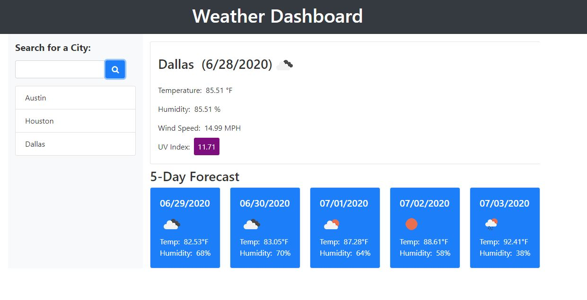

# Weather Dashboard

Weather Dashboard allows to see the current weather and 5 days forecast for a selected city.
If you enter the city name and click search, weather information gets populated. The city is also added to the list of 
selected citites which is saved to Local Storage.
Alternatively you can click on the city in the list that contains previously searched cities. This list gets populated from the Local Storage.

UV index is displayed as follows:
0 to 2: Low (green)
3 to 5: Moderate (yellow)
6 to 7: High (orange)
8 to 10: Very High (red)
11 or more: Extreme (purple)

It is built by using HTML, JavaScript, Bootstrap and Server-Side APIs.

# Deployed web site

The link to deployed site is https://evkonradi.github.io/WeatherDashboard/.

# GitHub repository

You can find the repository here: https://github.com/evkonradi/WeatherDashboard.

# Page preview

This is the preview of the initial page:
